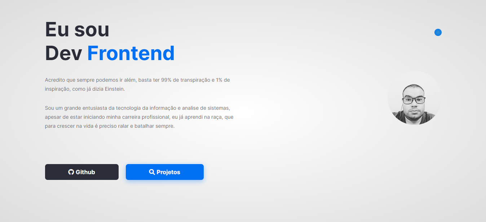

<div align="center" id="top"> 
  

  &#xa0;

  <!-- <a href="https://landingpagepersonal.netlify.com">Demo</a> -->
</div>

<h1 align="center">Landing Page Personal</h1>

<p align="center">
  

  

  

  

  

  
</p>


<hr>

<p align="center">
  <a href="#dart-sobre">Sobre</a> &#xa0; | &#xa0; 
  <a href="#sparkles-funcionalidades">Funcionalidades</a> &#xa0; | &#xa0;
  <a href="#rocket-tecnologias">Tecnologias</a> &#xa0; | &#xa0;
  <a href="#white_check_mark-pré-requisitos">Pré requisitos</a> &#xa0; | &#xa0;
  <a href="#checkered_flag-começando">Começando</a> &#xa0; | &#xa0;
  <a href="#memo-licença">Licença</a> &#xa0; | &#xa0;
  <a href="https://github.com/Gabriel4420" target="_blank">Autor</a>
</p>

<br>

## :dart: Sobre ##

Landing Page Pessoal sobre meus projetos e divulgação das minhas redes sociais

## :sparkles: Funcionalidades ##

:heavy_check_mark: Sobre Mim
:heavy_check_mark: Meus Projetos em formato de Cards
:heavy_check_mark: Animações simples com CSS

## :rocket: Tecnologias ##

As seguintes ferramentas foram usadas na construção do projeto:

- [HTML5](https://expo.io/)
- [CSS3](https://nodejs.org/en/)


## :white_check_mark: Pré requisitos ##

Antes de começar :checkered_flag:, você precisa ter o [Git](https://git-scm.com) e o [Node](https://nodejs.org/en/) instalados em sua maquina.

## :checkered_flag: Começando ##

```bash
# Clone este repositório
$ git clone https://github.com/Gabriel4420/my-landing-projects

# Entre na pasta
$ cd public

# Instale as dependências
$ yarn

# Para iniciar o projeto
$ yarn start

# O app vai inicializar em <http://localhost:3000>
```

## :memo: Licença ##

Este projeto está sob licença MIT. Veja o arquivo [LICENSE](LICENSE.md) para mais detalhes.


Feito com :heart: por <a href="https://github.com/Gabriel4420" target="_blank">Gabriel Rodrigues Perez</a>

&#xa0;

<a href="#top">Voltar para o topo</a>
